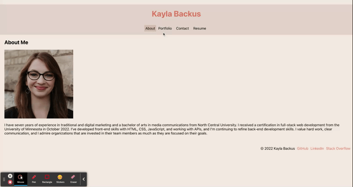

# Portfolio Built with React

## Description
This single page application built with React is a portfolio of my work.

Deployed application: [http://kaylab78.github.io/react-portfolio](http://kaylab78.github.io/react-portfolio)

## Table of Contents
- [Installation](#installation)
- [Usage](#usage)
- [Technologies](#technologies)
- [License](#license)
- [Credits](#credits)

## Installation
In order to use this project, the user must have Node.js installed on their local machine.

To clone the repository, type `git clone git@github.com:kaylab78/react-portfolio.git` in the command-line interface.

Once the repository is cloned, use `npm i` to install the required packages.

To deploy the project after changes are made, use the `npm run build` command in the CLI to build a new project in the build folder. Then run `npm run delpoy` to deploy the project to GitHub pages.

## Usage
When the user visits the page for the first time, they are presented with the page header and About Me section. When the user clicks on the Portfolio link in the header, they can view the portfolio projects. When the user clicks on the Contact link in the header, they are presented with a contact form where they can send a message to the owner of the portfolio. When the user clicks on the Resume link in the header, they will see a link to download the portfolio owner's resume. They will also see a list of the owner's skills. In the footer, the user is able to visit the portfolio owner's GitHub profile, LinkedIn profile, and Stack Overflow profile.

## Technologies
- [Create React App](https://github.com/facebook/create-react-app)
- [EmailJS](https://www.emailjs.com/)
- [jest-dom](https://github.com/testing-library/jest-dom)
- [Node.js](https://nodejs.dev/)
- [React](https://reactjs.org/)
- [React Testing Library](https://www.npmjs.com/package/@testing-library/react)

## License
&copy; 2022 by Kayla Backus

This project is licensed under the MIT license.

[License: MIT License](https://opensource.org/licenses/MIT)

## Credits
Boot Camp Module 20

Boot Camp Tutor Meg Meyers helped with conditionally rendering the different components on the page.

Charles, C. [Chaoo Charles]. (2022, March 23). *React: Send email from contact form without server code - Email.js Tutorial* [Video]. YouTube. [https://youtu.be/bMq2riFCF90](https://youtu.be/bMq2riFCF90)

Coyier, C. (20216, May 25). *Sticky Footer, Five Ways.* CSS-Tricks. [https://css-tricks.com/couple-takes-sticky-footer/](https://css-tricks.com/couple-takes-sticky-footer/)

*CSS Links.* (n.d.). W3Schools. Retrieved September 5, 2022, from [https://www.w3schools.com/css/css_link.asp](https://www.w3schools.com/css/css_link.asp)